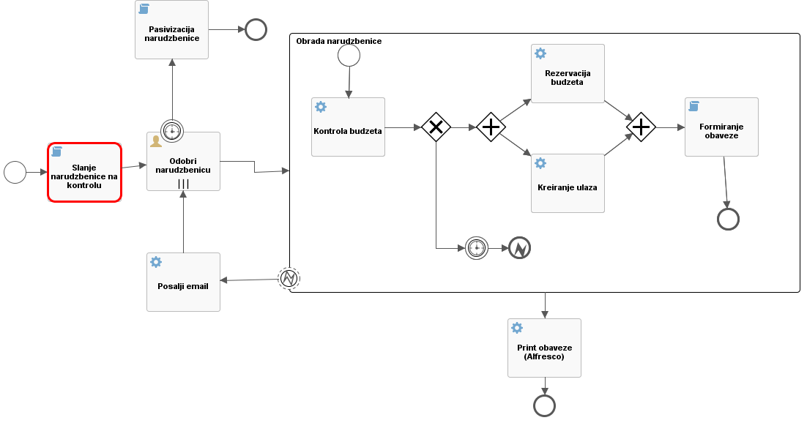

# Activiti Spring application: Ordering process
## Preface
The main purpose of this project is to learn and demonstrate various Activiti features. Application shows simple ordering business process and web aplication for starting and monitoring this process. The app is work in progress!

## Ordering process
Here is a simple description of ordering process used in this application.

After user (with role referent) starts process, script task ('Slanje narudzbenice na kontrolu') is executed and after that user task is created. In this example, two user roles (kontrolor and menadzer) have to approve order. If order is not approved in 20 minutes, order is destroyed. After order approval, subprocess is started. Main parts in subprocess are control of budget and generating error (if there is not enough money) or decrementing budget and generating supplement documents (if there is enough money). All service task are calling TestBean which actually does the job of dealing with orders and budgets.

## Getting Started

If you wish to try this example, please download source code from repository clicking on [link](https://github.com/almirpehratovic/activiti-spring-demo/archive/master.zip). Extract the project somewhere on disk and turn on Spring STS. Inside Spring STS import project by choosing File - Import - Maven - Existing Maven Project and navigating to extracted folder. Spring STS will import project and download all java dependencies configured in pom.xml file.

This project is using various Java anntotations that are not compatible with older java versions so we have to change compatibility to Java 1.6. In project properties (right click on project name) in Java Compiler section choose Compiler compliance level as 1.6, and in Java Build Path section on Libraries tab remove JRE 1.5 library and add your installed Java sdk version greater than 1.5. Spring STS will rebuild the project. All that is left is email configuration that should be set in src/main/resources/email/email.properties (username and password).

Finally, to run the example, right click on the project and choose Run as - Maven build. As a goal type tomcat7:run. First time Spring STS will download tomcat7 web server and at the end run the app. To try application, in favorite web browser type http://localhost:8080/activiti/orders and that's it. User that can start processes is mujo.mujic/mujo, and two users that have to approve order are dzevad.alihodzic/dzevad and nizama.buljubasic/nizama.

To enable sending email messages from process, please change email details in app-context-activiti.xml and app-context-standalone.xml.

